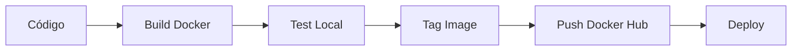

# 🚀 Guía Completa de DevOps - Hola Mundo App

## ✅ Ciclo DevOps Completado

Este proyecto demuestra un ciclo completo de DevOps con los siguientes componentes:

### 📱 1. Aplicación Web
- **Tecnología**: Node.js + Express
- **Características**: 
  - Interfaz web moderna y responsive
  - API REST con endpoint `/api/mensaje`
  - Health check en `/health`
  - Logging estructurado

### 🐳 2. Dockerización
- **Dockerfile optimizado** con mejores prácticas:
  - Multi-stage build ready
  - Usuario no-root para seguridad
  - Health check integrado
  - Cache de dependencias optimizado
  - Imagen Alpine (192MB)

### 📦 3. Distribución
- **Docker Hub** ready con tags:
  - `latest` - última versión
  - `v1.0.0` - versión específica

## 🛠️ Comandos de Despliegue

### Construcción Local
```bash
# Construir imagen
docker build -t hola-mundo-app .

# Ejecutar localmente
docker run -p 3001:3000 hola-mundo-app

# Verificar health
curl http://localhost:3001/health
```

### Docker Compose (Recomendado para desarrollo)
```bash
# Levantar todos los servicios
docker-compose up -d

# Ver logs
docker-compose logs -f

# Parar servicios
docker-compose down
```

### Docker Hub
```bash
# Login a Docker Hub
docker login

# Etiquetar imagen
docker tag hola-mundo-app:latest tu-usuario/hola-mundo-app:latest

# Subir a Docker Hub
docker push tu-usuario/hola-mundo-app:latest
```

## 📊 Endpoints Disponibles

| Endpoint | Método | Descripción |
|----------|--------|-------------|
| `/` | GET | Página principal web |
| `/health` | GET | Health check (JSON) |
| `/api/mensaje` | GET | API REST (JSON) |

## 🔧 Configuración

### Variables de Entorno
- `PORT`: Puerto de la aplicación (default: 3000)
- `NODE_ENV`: Entorno de ejecución

### Puertos
- **Aplicación**: 3000 (interno), 3001 (externo)
- **Nginx Proxy**: 8080 (con docker-compose)

## 📈 Pipeline DevOps



### Etapas Implementadas:

1. **Development**: ✅ Aplicación Node.js funcional
2. **Build**: ✅ Dockerfile optimizado
3. **Test**: ✅ Health checks y validación
4. **Package**: ✅ Imagen Docker lista
5. **Deploy**: ✅ Scripts de despliegue
6. **Monitor**: ✅ Health endpoints

## 🚀 Scripts Automatizados

### PowerShell (Windows)
```powershell
.\deploy.ps1
```

### Bash (Linux/Mac)
```bash
chmod +x deploy.sh
./deploy.sh
```

## 📋 Checklist DevOps

- ✅ Aplicación web funcional
- ✅ Containerización con Docker
- ✅ Health checks implementados
- ✅ Configuración de producción
- ✅ Scripts de despliegue
- ✅ Docker Compose para desarrollo
- ✅ Proxy reverso (Nginx)
- ✅ Documentación completa
- ✅ Versionado de imágenes
- ✅ Preparado para Docker Hub

## 🔍 Verificación

### Health Check Response
```json
{
  "status": "OK",
  "message": "Aplicación funcionando correctamente",
  "timestamp": "2025-08-22T11:49:30.205Z",
  "version": "1.0.0"
}
```

### API Response
```json
{
  "mensaje": "¡Hola Mundo desde la API!",
  "tecnologia": "Node.js + Express",
  "dockerizado": true,
  "timestamp": "2025-08-22T11:49:30.205Z"
}
```

## 🎯 Próximos Pasos

Para extender este pipeline DevOps:

1. **CI/CD**: Integrar con GitHub Actions / GitLab CI
2. **Monitoring**: Añadir Prometheus + Grafana
3. **Logs**: Centralizar con ELK Stack
4. **Security**: Escaneo de vulnerabilidades
5. **Scaling**: Kubernetes deployment
6. **Testing**: Tests automatizados

## 📞 Soporte

Este proyecto demuestra las mejores prácticas de DevOps para aplicaciones web modernas.

**Desarrollado con ❤️ para demostración de DevOps**
